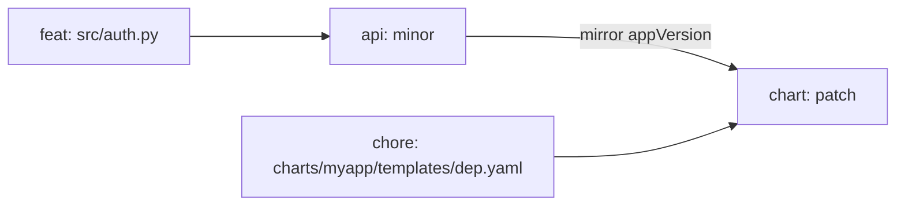

# Concepts

## Components

A component is a unit that ships independently: a Python service, a
Helm chart, a frontend, a Cargo crate, a Debian package. Components are
keyed by name, and a name appears in:

- the git tag (default `{component}-v{version}`),
- the per-component `CHANGELOG.md` location,
- JSON output and release-notes headings,
- the `--force NAME:KIND` CLI syntax.

Names are restricted to `^[a-zA-Z0-9](?:[a-zA-Z0-9_.-]*[a-zA-Z0-9])?$`
(≤ 64 chars). Slashes, colons, spaces, leading/trailing dots are
rejected at config-load time. Examples that load: `api`, `api-v1`,
`api.v1`, `myapp-chart`. Rejected: `api/v1`, `chart:prod`, `my app`,
`-foo`.

Two TOML syntaxes parse to the same internal shape:

=== "Dict-of-tables"

    ```toml
    [components.api]
    paths = ["src/**", "pyproject.toml"]

    [components.web]
    paths = ["frontend/**"]
    ```

=== "Array-of-tables"

    ```toml
    [[components]]
    name  = "api"
    paths = ["src/**", "pyproject.toml"]

    [[components]]
    name  = "web"
    paths = ["frontend/**"]
    ```

`multicz init` emits the dict-of-tables form by default; the
array form is preferred when component order matters or you have many
of them.

## Paths

`paths` is a list of gitignore-style globs declaring which files a
component owns. A commit's changed files are matched against every
component's `paths`; ownership decides which component the commit
"belongs to" — and therefore which one bumps.

```toml
[components.api]
paths = ["src/**", "pyproject.toml", "tests/**", "Dockerfile"]
```

`exclude_paths` removes matches from a glob:

```toml
[components.api]
paths         = ["src/**"]
exclude_paths = ["src/legacy/**"]
```

When two components claim the same file, behaviour is governed by
[`overlap_policy`](#overlap-policy).

## Bump files

`bump_files` declares where the canonical version is written for a
component:

```toml
[components.api]
paths      = ["src/**", "pyproject.toml"]
bump_files = [{ file = "pyproject.toml", key = "project.version" }]
```

`key` is a dotted path inside structured files (TOML, YAML, JSON,
`.properties`). For plain text files (e.g. a single-line `VERSION`),
omit `key`. For files no structured parser handles (Python
`__version__`, TypeScript `export const VERSION`, Makefile `VERSION
:=`), use the [regex escape hatch](#regex-escape-hatch).

Supported file formats:

- `.toml` — comments and key order preserved (`tomlkit`)
- `.yaml` / `.yml` — comments and quote style preserved (`ruamel.yaml`)
- `.json` — indent and key order preserved (`package.json`)
- `.properties` — line-based `key=value` (`gradle.properties`)
- anything else — treated as a one-line `VERSION` file

### Regex escape hatch

Prefix `key` with `regex:` and supply a pattern with exactly one
capture group locating the version literal:

```toml
[components.api]
bump_files = [
    { file = "pyproject.toml", key = "project.version" },
    { file = "src/api/__init__.py", key = 'regex:^__version__\s*=\s*"([^"]+)"' },
]
```

Matching uses `re.MULTILINE`. Only the first match's capture group is
rewritten; surrounding text is preserved byte-for-byte. Bad patterns
surface at `multicz validate --strict`.

## Mirrors

A `mirror` writes a component's version into another file — typically a
sibling component's manifest. The canonical case is a Helm chart's
`appVersion` mirroring the API version:

```toml
[components.api]
paths   = ["src/**", "pyproject.toml"]
mirrors = [{ file = "charts/myapp/Chart.yaml", key = "appVersion" }]
```

When the mirror writes inside `chart`'s `paths`, `chart` cascades a
patch bump because a file it owns changed. This keeps Helm chart
immutability: `chart-0.5.0` always pins the same `appVersion`.

## Triggers and dependencies

`depends_on` declares an explicit upstream relationship: when the
upstream bumps, the dependent bumps too — without writing a file.

```toml
[components.chart]
paths      = ["charts/myapp/**"]
depends_on = ["api"]
```

The legacy alias `triggers = [...]` still parses; both fold into
`depends_on`.

The bump kind on the dependent is governed by
[`trigger_policy`](configuration.md#trigger_policy):

| value | behaviour |
|---|---|
| `match-upstream` (default) | dependent inherits the upstream's kind |
| `patch` | dependent always patches when its upstream bumps |

!!! note "Mirrors vs. depends_on"

    Both create cascades, but they're different. `mirrors` writes a
    *version* into another component's *file* and the cascade fires
    because the file content changed. `depends_on` is purely logical —
    no file is written. A chart with `appVersion` typically declares
    *both*; the mirror handles the field, and `depends_on = ["api"]`
    is then redundant (the cascade fires either way).

## Cascade semantics

The planner runs three passes:

1. **direct** — for each component, look at conventional commits since
   its last tag whose changed files map to it; pick the strongest
   implied bump.
2. **dependencies** — propagate bumps along declared `depends_on` edges
   (using `trigger_policy`).
3. **mirror cascade** — when a component A writes its version into a
   file owned by component B, B receives a patch bump.



## Bump kind by commit type

| commit | bump |
|---|---|
| `feat: …` | minor |
| `feat!: …` or `BREAKING CHANGE:` footer | major |
| `fix: …` | patch |
| `perf: …` | patch |
| `revert: …` | patch — user-visible activity |
| `chore`, `docs`, `style`, `test`, `build`, `ci`, `refactor` | none |
| anything not matching `<type>(<scope>)?: <subject>` | controlled by [`unknown_commit_policy`](configuration.md#unknown_commit_policy) |

## Bump policy

When a single commit touches files owned by multiple components, each
component gets that commit's bump kind by default
(`bump_policy = "as-commit"`). Components that want stricter semantics
opt into `scoped`:

```toml
[components.chart]
paths       = ["charts/myapp/**"]
bump_policy = "scoped"
```

| commit | api | chart |
|---|---|---|
| `feat: cross-cutting change` (no scope) | minor | minor |
| `feat(api): rewrite contract` | minor | **patch** (demoted) |
| `feat(chart): add value` | — | minor |
| `fix: typo` | patch | patch |

`scoped` demotes `minor`/`major` to `patch` when the commit's scope
names a different component. No-scope commits still propagate as-is.
Demotions surface in `multicz explain` and the JSON output as
`original_kind` alongside `bump_kind`.

## Overlap policy

When two components both list `src/**`, behaviour is governed by
[`overlap_policy`](configuration.md#overlap_policy) on `[project]`:

| value | `validate` | runtime |
|---|---|---|
| `error` (default) | error | refuses to plan/bump |
| `first-match` | warning | first-declared owns the file |
| `allow` | silent | same as `first-match` |
| `all` | info | bumps every claiming component |

`all` is the right choice for monorepos where several components
share code:

```toml
[project]
overlap_policy = "all"

[components.api]
paths = ["src/**", "pyproject.toml"]

[components.worker]
paths = ["src/**", "workers/**"]
```

## Version schemes

Pre-release versions render differently across ecosystems:

| ecosystem | form | example |
|---|---|---|
| npm, Cargo, Helm, generic | semver 2.0 | `1.3.0-rc.1` |
| Python (canonical PEP 440) | dotless | `1.3.0rc1` |
| Debian source packages | tilde | `1.3.0~rc1` |

The default `version_scheme = "semver"` works for npm, Cargo, Helm, and
is also accepted by PEP 440 (just normalized internally). For strict
canonical Python output, opt into `pep440` per-component:

```toml
[components.api]
bump_files     = [{ file = "pyproject.toml", key = "project.version" }]
version_scheme = "pep440"
```

`format = "debian"` requires `version_scheme = "semver"` (the canonical
internal form); the Debian renderer applies its own `~rc1` notation
at write time.

## Tags

Each component gets its own annotated git tag, rendered from
`tag_format` with `{component}` and `{version}` placeholders. Default
`{component}-v{version}` produces:

```
api-v1.3.0
api-v1.4.0-rc.1
chart-v0.5.0
mypkg-v1.3.0          # debian-format components keep semver in the tag
```

Each component's *rendered prefix* must be unique across the project,
otherwise `git tag --list <prefix>*` returns tags from another
component and the planner reads the wrong "current" version. Loading a
config where two components produce the same prefix is rejected.

Per-component override:

```toml
[project]
tag_format = "{component}-v{version}"

[components.legacy]
paths      = ["legacy/**"]
tag_format = "v{version}"          # keep the historical scheme
```

See [tag migration](recipes.md#migrating-from-a-single-tag-scheme) for
moving an existing repo onto multicz tags.

## Auto-discovery

`multicz init` scans the working tree for these manifests and seeds one
component per detected project:

| ecosystem | manifest | name source |
|---|---|---|
| Python | `**/pyproject.toml` | `[project].name` (PEP 621) or `[tool.poetry].name` |
| Helm | `**/Chart.yaml` | `name:` field |
| Rust | `**/Cargo.toml` | `[package].name`; workspaces collapse when `[workspace.package].version` is shared |
| Go | `**/go.mod` | last segment of `module …` (strips `/vN`) — tag-driven, no version file |
| Gradle | root `gradle.properties` with `version=` | `rootProject.name` from `settings.gradle[.kts]` |
| Node.js | root `package.json` (or workspace members) | `name` field (npm scopes stripped) |
| Debian | `debian/changelog` | package name from the top stanza header |

Common noise dirs (`.git`, `node_modules`, `.venv`, `target`, `build`,
`dist`, `vendor`) are excluded.

### Workspace rules

A workspace orchestrator with no version is never a component — its
job is to delegate, not to ship. A root that doubles as a package
(common for Python and Cargo) is a component, alongside its members.
Excluded members declared in `[tool.uv.workspace].exclude`,
`[workspace].exclude`, npm/yarn `"!packages/legacy"`, or
`pnpm-workspace.yaml` are honored.

When two manifests share a name, `_unique` auto-suffixes the second
with the manifest type (`api` + `api-chart`).

## Config discovery

`multicz` looks for, in this order at each directory level (walking up
from the cwd):

1. `multicz.toml` (always wins when present)
2. `pyproject.toml` *with* a `[tool.multicz]` table
3. `package.json` *with* a `"multicz"` key

A `pyproject.toml` without `[tool.multicz]` is silently skipped — it's
not treated as the multicz config.

## Optional state file

Multicz is normally stateless — every command recomputes from git tags
and the in-tree manifests. For monorepos that want a persistent audit
trail or **drift detection**, opt into a state file:

```toml
[project]
state_file = ".multicz/state.json"
```

After every successful `multicz bump`, the file is written and lands in
the release commit. `multicz validate` then adds two checks:

- `state_drift` (warning) — recorded version doesn't match the current
  primary `bump_file` value (someone edited it manually).
- `state_unknown_component` (warning) — state references a name no
  longer declared.

Inspect with `multicz state` (text or JSON).

## Ignoring commit types

Some commit types should never appear in any bump or changelog:

```toml
[project]
ignored_types = ["chore", "ci", "docs", "test", "style"]
```

Or per-component (the effective set is the union):

```toml
[components.api]
ignored_types = ["fix"]
```

The filter is stricter than `release_commit_pattern`: `ignored_types`
short-circuits before bump kind is computed, so even `feat!: ...` is
dropped if `feat` is in the list.
