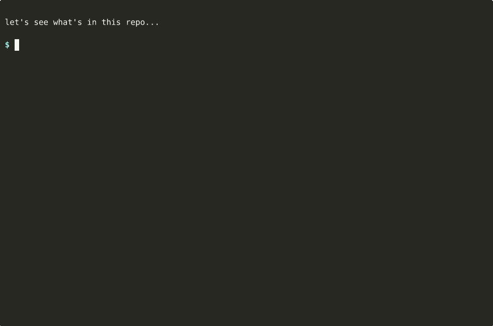

# multicz

Multi-component versioning for monorepos. Bump a Python app, its Docker
image, and the Helm chart that deploys it from a single conventional-commit
history — each with its own version line and its own git tag.



## The problem

You have one repo with a few moving parts:

```
repo/
├── src/                 # FastAPI app
├── pyproject.toml       # → version 1.2.0
├── Dockerfile           # built and tagged from the app version
└── charts/myapp/
    ├── Chart.yaml       # version: 0.4.0 / appVersion: 1.2.0
    └── templates/       # kubernetes manifests
```

A change to `src/` is a new app release; a change only under
`charts/myapp/templates/` is a new chart release for the *same* app.
Standard tools bump everything together or force you to script per-folder
logic. `multicz` makes the rule explicit in `multicz.toml`.

## What it does

- Reads conventional commits since each component's last tag.
- Picks the strongest implied bump per component (`feat` → minor,
  `fix`/`perf` → patch, `!`/`BREAKING CHANGE:` → major).
- Cascades bumps through declared mirrors and dependencies (e.g. a Helm
  chart's `appVersion` mirroring the API version).
- Writes the new version into `pyproject.toml`, `Chart.yaml`,
  `package.json`, `Cargo.toml`, `gradle.properties`, `debian/changelog`,
  or any file matched by a regex.
- Optionally creates a release commit and per-component annotated tags;
  pushes only when asked.

It does **not** build or push artifacts. CI does that, using the rendered
plan as input.

## Quickstart

```bash
uv add --dev multicz        # or: pip install multicz
multicz init                # writes a starter multicz.toml
multicz status              # show which components would bump and why
multicz bump --dry-run      # plan the bump without touching files
multicz bump                # apply the plan
```

A typical CI release step:

```bash
multicz validate --strict
multicz bump --commit --tag --push
```

## Where to go next

- New repo, new install? [Get started](get-started.md).
- Want to understand the model — components, mirrors, cascades, bump
  policy? [Concepts](concepts.md).
- Looking up a config field? [Configuration reference](configuration.md).
- Looking up a flag or command? [CLI reference](cli.md).
- Concrete walkthroughs (FastAPI + Helm, CI matrix, RC cycle, manual
  bump)? [Recipes](recipes.md).
- Comparing to `semantic-release`, Commitizen, Changesets, or
  `bump-my-version`? [Why multicz?](why.md).
- Hardening for CI? [Security](security.md).

## License

[MIT](https://github.com/goabonga/multicz/blob/main/LICENSE)
