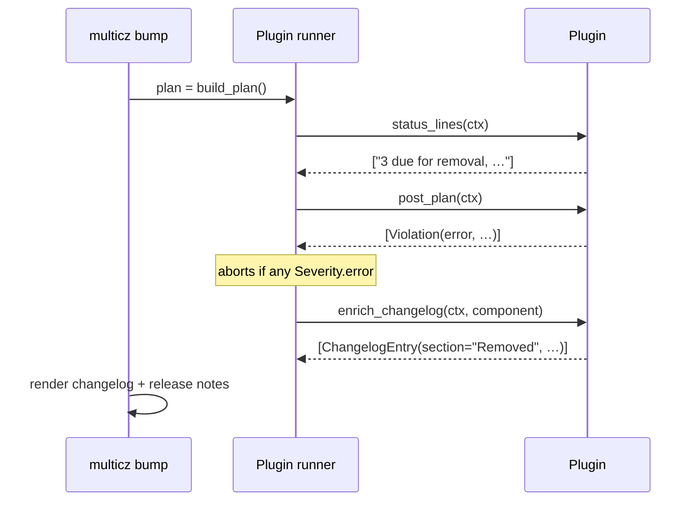

# Plugins

`multicz` ships with a small plugin system that lets external code
participate in the release pipeline without forking the core. Plugins
can:

- **gate** a `multicz bump` (block the bump on policy violations),
- **enrich** the rendered changelog and release notes with sections of
  their own,
- **surface advice** in `multicz status` / `multicz plan` so the user
  knows about a pending gate before it fires.

A plugin is a Python package that registers a class under the
`multicz.plugins` [entry-point group](https://packaging.python.org/en/latest/specifications/entry-points/).
There is **no privileged loader path**: built-in plugins use the exact
same mechanism as third-party ones.

## Activation { #activation }

Discovery alone is not activation. Even a freshly-installed plugin
stays dormant until the project's `multicz.toml` declares it:

```toml
[plugins.deprecation]
```

The empty section is the minimum opt-in — it means "run with all
defaults". Three states are possible per plugin:

| state | meaning |
|---|---|
| `active`   | `[plugins.<name>]` is declared and `enabled` is not `false`. The runner invokes every hook. |
| `disabled` | section declared, but `enabled = false`. Opt-out without deleting the section. |
| `inactive` | plugin discovered (entry point registered) but no `[plugins.<name>]` section. Hooks are **not** called. |

`multicz plugins` lists every discovered plugin with its current
state:

```
┃ Plugin      ┃ Status   ┃ Module                       ┃ Config section            ┃
│ deprecation │ inactive │ multicz.plugins.builtin.…    │ (not in multicz.toml — add [plugins.deprecation] to activate) │
│ newsy       │ active   │ newsy                        │ [plugins.newsy] directory='changes.d', …                       │
```

Same command with `--output json` for CI consumption — each row
carries `status`, `configured`, and `enabled` fields plus the
plugin's resolved `module` / `class` / `config` dict.

!!! tip

    A plugin you don't recognize in `multicz plugins` came in via a
    transitive dependency. Until you add `[plugins.<name>]`, it
    can't affect your bumps — so the safe default for an unfamiliar
    plugin is to leave it `inactive`.

## Hooks { #hooks }

A plugin is a class implementing three hooks. The runner calls them
in this order during a bump:



Every hook receives the same `PluginContext`:

| field | content |
|---|---|
| `ctx.config`        | the parsed multicz config (whole file — read other sections if you need them) |
| `ctx.repo`          | absolute `Path` to the repository root |
| `ctx.plan`          | the computed `Plan`; iterate `ctx.plan` or look up `ctx.plan.bumps[component]` |
| `ctx.plugin_config` | **only** the `[plugins.<name>]` slice of the user's config, defaulted to `{}` if absent |

### `post_plan` { #post_plan }

```python
def post_plan(self, ctx: PluginContext) -> list[Violation]: ...
```

Called once after the plan is computed and before any file is written.
Return a list of [`Violation`](#violation) objects:

- `Severity.error` aborts the bump (exit code 1).
- `Severity.warning` prints but lets the bump proceed.
- `Severity.info` is purely informational.

A plugin that raises is caught by the runner, logged as a
`RuntimeWarning`, and treated as if it returned `[]`. Other plugins
still run.

### `enrich_changelog` { #enrich_changelog }

```python
def enrich_changelog(
    self, ctx: PluginContext, component: str,
) -> list[ChangelogEntry]: ...
```

Called per component during changelog / release-notes rendering.
Return [`ChangelogEntry`](#changelog-entry) objects; each one becomes a
section in the rendered markdown. Sections returned with the same
title (`section="Removed"`, etc.) merge with whatever the
conventional-commit renderer produced — no duplicate H3.

### `status_lines` { #status_lines }

```python
def status_lines(self, ctx: PluginContext) -> list[str]: ...
```

Called by `multicz status` and `multicz plan`. Each returned string is
printed verbatim under the bump table, prefixed with a magenta arrow.
Rich markup (`[bold]`, `[red]`, …) is supported — escape literal
brackets with `\[` if you mean them literally.

## Data types { #data-types }

### `Violation` { #violation }

```python
@dataclass(frozen=True, slots=True)
class Violation:
    severity: Severity              # "error" | "warning" | "info"
    message: str
    plugin: str
    file: Path | None = None
    line: int | None = None
    component: str | None = None
```

### `ChangelogEntry` { #changelog-entry }

```python
@dataclass(frozen=True, slots=True)
class ChangelogEntry:
    section: str                    # e.g. "Removed", "Deprecated"
    component: str
    lines: tuple[str, ...] = ()     # one rendered bullet per line
```

## Built-in plugins { #builtin }

### `deprecation` { #deprecation }

Enforces a removal policy on `@deprecated(since=..., remove_in=...)`
markers (and `# DEPRECATED since=.. remove_in=..` comments). Behaviour:

- **`post_plan`** — every marker whose `remove_in ≤ next_version`
  raises a violation. By default `Severity.error`; flip to a warning
  with `mode = "warning"` during initial rollout.
- **`enrich_changelog`** — emits a `Deprecated` section for markers
  newly added in this release window and a `Removed` section for
  markers whose deadline matches the planned version.
- **`status_lines`** — one summary line per component:
  `deprecation[api 1.0.0 → 2.0.0]: 1 added, 1 due for removal, 1 upcoming`.

Config keys:

```toml
[plugins.deprecation]
# Refuse the bump on past-due markers ("error", default) or just warn ("warning").
mode = "error"
# Override the scan globs. When omitted, falls back to each component's `paths`.
scan = ["src/**/*.py"]
# Different globs per component, when a single project mixes scan needs.
[plugins.deprecation.scan_per_component]
api    = ["src/api/**/*.py"]
worker = ["src/worker/**/*.py"]
```

Runnable example: [`examples/deprecation-plugin/`](https://github.com/goabonga/multicz/tree/main/examples/deprecation-plugin).

### `upstream-notes` { #upstream-notes }

Injects the *commits* of upstream components — not just their version
— into a downstream component's changelog and release notes. Aimed at
`depends_on` chains where a deploy pipeline commits **after** the
upstream release (Terraform, GitOps rollouts, chart-of-charts):

```
module  --(depends_on)-->  root  --(deploy pipeline)-->  config-*
```

When `config-prod` bumps via a `deploy:` commit, the plugin adds one
section per upstream, listing the commits merged since the previous
`config-prod` release:

```markdown
### Upstream: root (v1.3.0 → v1.4.0)
- feat(network): add private endpoint subnet (a1b2c3d)

### Upstream: module (v0.9.1 → v0.9.2)
- fix: pin azurerm provider (d4e5f6a)
```

Baseline resolution — for each upstream, the "previous" version is the
highest upstream tag **merged into the downstream's previously
released tag** (`git tag --merged <comp-prev-tag>`); the "new" version
is the latest upstream tag reachable from HEAD. So even when the
deploy commit lands *after* the upstream release (separate pipeline
run), everything tagged upstream since the last downstream release is,
by construction, what this deployment ships.

Behaviour:

- **`enrich_changelog`** — one `Upstream: <name> (v… → v…)` section per
  upstream whose tag advanced. Commits are filtered by the same
  `release_commit_pattern` and per-component `ignored_types` that the
  planner uses, and only commits touching files owned by the upstream
  are kept.
- **`status_lines`** — advertises pending drift in `multicz status` /
  `multicz plan` so the section isn't a surprise at bump time.

Config keys:

```toml
[plugins.upstream-notes]
# Max bullets per Upstream section; the plugin appends "… and N more"
# past this cap.
max_commits = 30
# When true, prereleases (rc / beta / …) count as valid upstream heads.
include_prereleases = false

# Explicit upstream mapping. When absent, falls back to the transitive
# closure of each component's ``depends_on``.
[plugins.upstream-notes.upstreams]
config-prod    = ["root", "module"]
config-staging = ["root", "module"]
```

## Writing a plugin { #authoring }

The fastest path is to subclass `BasePlugin`, which provides no-op
defaults so you only implement the hooks you care about:

```python title="src/newsy/__init__.py"
from multicz.plugins import (
    BasePlugin,
    ChangelogEntry,
    Severity,
    Violation,
)


class NewsyPlugin(BasePlugin):
    name = "newsy"  # (1)!

    def post_plan(self, ctx) -> list[Violation]:
        return [] if self._fragments(ctx) else [
            Violation(
                severity=Severity.error,
                message="no changelog fragments — add one under changes.d/",
                plugin=self.name,
            )
        ]

    def enrich_changelog(self, ctx, component) -> list[ChangelogEntry]:
        return [
            ChangelogEntry(section=section, component=component, lines=lines)
            for section, lines in self._render(ctx).items()
        ]

    def status_lines(self, ctx) -> list[str]:
        return [f"newsy: {len(self._fragments(ctx))} fragment(s)"]
```

1. `name` must match the entry-point key in `pyproject.toml` **and**
   the `[plugins.<name>]` section a consumer writes in their
   `multicz.toml`. Pick something short, kebab-case, namespace-y if
   collisions are likely.

Register it via the entry-point group — this is what makes it
discoverable to any multicz install:

```toml title="pyproject.toml"
[project]
name = "newsy"
dependencies = ["multicz"]

[project.entry-points."multicz.plugins"]
newsy = "newsy:NewsyPlugin"
```

That's the whole API surface. Multicz handles discovery, config
slicing, hook ordering, and exception isolation; the plugin only has
to implement the hooks it cares about.

Runnable example, full code + README: [`examples/custom-plugin/`](https://github.com/goabonga/multicz/tree/main/examples/custom-plugin).

## Reference { #reference }

- Plugin protocol + dataclasses: `multicz.plugins.protocol`
- Runner + entry-point discovery: `multicz.plugins.runner`,
  `multicz.plugins.registry`
- Built-in implementations: `multicz.plugins.builtin.*`
- CLI integration points: `multicz plugins` (this listing),
  `multicz status` / `plan` / `bump` (call sites for the three hooks).
